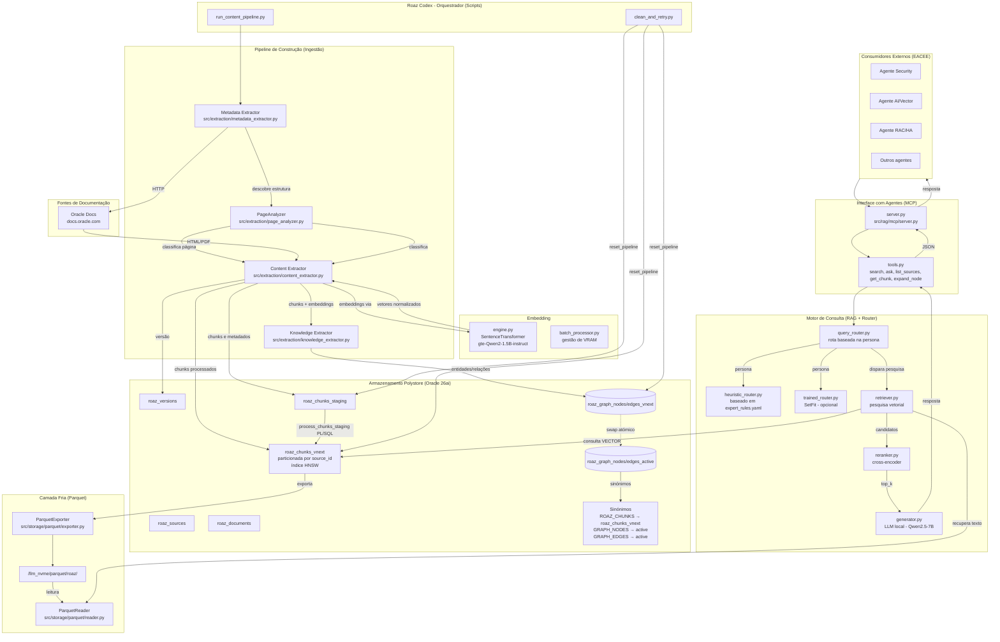

### Roaz Codex: Blueprint for Intelligent and Resilient Data Architecture

**1. Strategic Vision**
The Roaz Agent is an ecosystem of governance, resilience, and autonomous operation. 
Its purpose is to convert the complexity of data infrastructure into architectural agility, 
aligning technical database decisions (Oracle 26ai) with Enterprise Architecture (EA) guidelines. 
Roaz acts as a layer of Cognitive Security, eliminating the gap between exhaustive technical documentation and strategic execution.

**2. The Brain: Roaz Central Knowledge (RCK)**
The RCK has evolved into a matrix of 14 Pillars of Wisdom, structured in a vector search and GraphRAG model. 
This foundation ensures that the agent has context about:

- Observability & Runtime: OCI telemetry and execution logs.
- Design & Engineering: Modeling, APIs, and Delta Sharing protocols.
- Risk & Resilience: Incident playbooks and Disaster Recovery.
- Platform & Vendor: Licensing management and cloud economics.
- Security & IAM: Permission inheritance and STIG/CIS compliance.
- Strategic Alignment: OKRs and business goals.
- AI & Processing: Vector Search and integration with Foundation Models.
- Capacity & Baseline: Asset inventory and resource planning.
- FinOps & Efficiency: ROI and cost tracking of Workspaces.
- Quality & Governance: Unified metadata and Master Catalog.
- Integration & Migration: CI/CD pipelines and Cross-Catalog synchronization.
- Legal & Lifecycle: LGPD (Brazilian General Data Protection Law), data retention and sensitivity.
- Innovation & Future-Proofing: Emerging technologies (Quantum/Edge).
- Culture & Literacy: Data empowerment and adoption by Personas.

**3. Methodology: AI Data Platform Workbench**
Roaz utilizes the Unified AI Data Platform architecture, integrating distributed data under a single governance layer:

- Master Catalog & Discovery: Automatic identification of silos through metadata extraction (Auto-Populate).
- External Catalogs: Governance over data in Object Storage and external sources without the need for physical movement.
- Vector Readiness: Orchestration of vector indexes in Oracle 26ai to power the enterprise generative AI ecosystem.
- Isolated Workspaces: Segregated environments for engineering and data science experimentation with granular RBAC.

**4. Maturity and Alignment (EA) Layer**
The agent assesses the organizational context based on the Cloud Adoption Framework (CAF):

- Maturity Level: Diagnosis of whether the current scenario is Migration (Legacy), Modernization (Cloud-Native), or Innovation (AI-Driven).
- Business Alignment: Solution prioritization based on the deployment model (Exadata Cloud Service vs. ZDLRA On-Premises).
- Maximum Availability Architecture (MAA): Definition of resilience standards based on service criticality (BIA - Business Impact Analysis).

**5. Execution Protocol: The Shield**
Every action proposed by Roaz undergoes a triple validation filter before delivery:

- Syntactic/Version: Validation against specific syntax (e.g., Oracle 26ai).
- Security/Compliance: Verification of IAM policy violations and STIG standards.
- Architectural: Impact assessment on the FinOps pillar and alignment with the company baseline.
- Output Format (The Action Blueprint)
- The final deliverable consists of an auditable action plan:
- Pre-Execution Checklist: Validation of technical prerequisites.
- Execution Script: Commented and optimized code (SQL/Terraform/Ansible). Rollback Plan: Documented rollback procedure.
- Value Justification: Explanation of the direct impact on the business KPI (e.g., 20% reduction in operational cost).

**6. Technical Requirements and Implementation**
- Local RAG Architecture: Processing via local LLM ensuring that sensitive data and network metadata remain in the client's private environment.
- The Harvester (Synchronization): Continuous update module that ingests the latest updates from Oracle manuals, My Oracle Support (MOS), and security benchmarks.
- Multi-Person Interface:
- CDO/Manager: ROI, FinOps, and Risk view.
- Architect: CAF compliance, security, and interoperability.
- Engineer: Technical deep dive, automation, and vector performance.

**7. Competitive Advantage**
Roaz Codex is not just a task automation tool; it's an Assisted Strategy tool. 
It protects the company's intellectual capital, ensures that technological evolution towards the AI ​​age occurs resiliently, 
and transforms the database from a "cost center" into an engine of documented and secure strategic intelligence.

---

---

# Roaz Codex: Integrated Architecture & AI Governance Manifesto

This manifesto integrates Data, Business, Technology, Application, and Security domains, enriched with the Oracle AI Data Platform Workbench framework.

| ID | Pillar | Integrated Architecture Domains & Sub-themes | Data Source for Training / RAG |
|:---|:---|:---|:---|
| **01** | **Runtime & Observability** | Monitoring, Logging, SLA Management, Demand Forecasting, Workbench Resource Utilization. | OCI Monitoring/Logging APIs, V$Views, AWR Warehouse, Workbench Execution Logs. |
| **02** | **Design & Engineering** | Data Modeling, API Design, Workbench Workspaces, Component Design, Delta Sharing Protocols. | Oracle 26ai Dev Guides, AI Data Platform Workbench Specs, Internal Blueprints. |
| **03** | **Risk & Resilience** | Incident Response Playbooks, Mitigation Strategy, Business Continuity, Workspace Recovery. | My Oracle Support (MOS) KB, Post-Mortems, OCI Incident Reports, Risk Assessments. |
| **04** | **Platform & Vendor** | Cloud Platform Selection, Vendor Assessment, Licensing, Delta Sharing Standard, Multi-Cloud. | Cloud Adoption Frameworks (CAF), Vendor Contracts, Oracle AI Platform Feature Matrix. |
| **05** | **Security & IAM** | IAM Strategy, Permission Inheritance & Expansion, RBAC, Network Isolation (VCN), Audit Logging. | CIS Benchmarks, STIGs, IAM Audit Logs, OCI Security Policy Manuals. |
| **06** | **Strategic Alignment** | Business Goals, Change Management, Stakeholder Approval, Project Milestones, BIA. | Corporate Strategy Docs, Executive OKRs, Roadmaps, Business Impact Analysis. |
| **07** | **AI & Data Processing** | Vector Search, Foundation Model Integration (Llama/Cohere), Graph Analytics, Batch Inference. | Oracle 26ai Vector Guide, OCI Generative AI (oci_ai_models schema), AI Service Metadata. |
| **08** | **Capacity & Baseline** | Resource Estimation, IT Assessment, Architecture Baseline, Managed vs External Catalogs. | IT Asset Inventory, Historical Capacity Reports, OCI Resource Quotas, Config Files. |
| **09** | **FinOps & Efficiency** | ROI Tracking, Efficiency Optimization, Cloud Economics, Budgeting, Workspace Cost Tracking. | OCI Billing API (JSON/CSV), Cost Analysis Reports, Jira/DevOps Resource Metadata. |
| **10** | **Quality & Governance** | Data Quality, Master Catalog Management, Metadata Auto-Population, Assessment & Validation. | Master Catalog Metadata, DQ Rules Engine, Functional Requirement Docs (FRD). |
| **11** | **Integration & Migration** | Data Migration Planning, Integration Strategy, Data Transfer, Cross-Catalog Sync, CI/CD Pipelines. | Migration Runbooks, OCI Data Integration Metadata, Deployment Scripts, API Specs. |
| **12** | **Legal & Lifecycle** | Data Retention, Archival Planning, Compliance (LGPD/GDPR), Data Sensitivity, Data Sharing Legal. | Legal Compliance Manuals, DPIA Reports, Data Sharing Agreements, Retention Policies. |
| **13** | **Innovation & Future-Proofing** | Emerging Tech Assessment (Quantum, Edge AI), R&D Alignment, Technology Scouting. | Tech Whitepapers, Patent Databases, Scientific Journals, Internal R&D Reports. |
| **14** | **Data Culture & Literacy** | Role Definition, Team Building, Workbench Collaboration, Data Literacy Training. | Internal Training Logs, Skills Matrix, User Adoption Metrics, Feedback Loops. |

