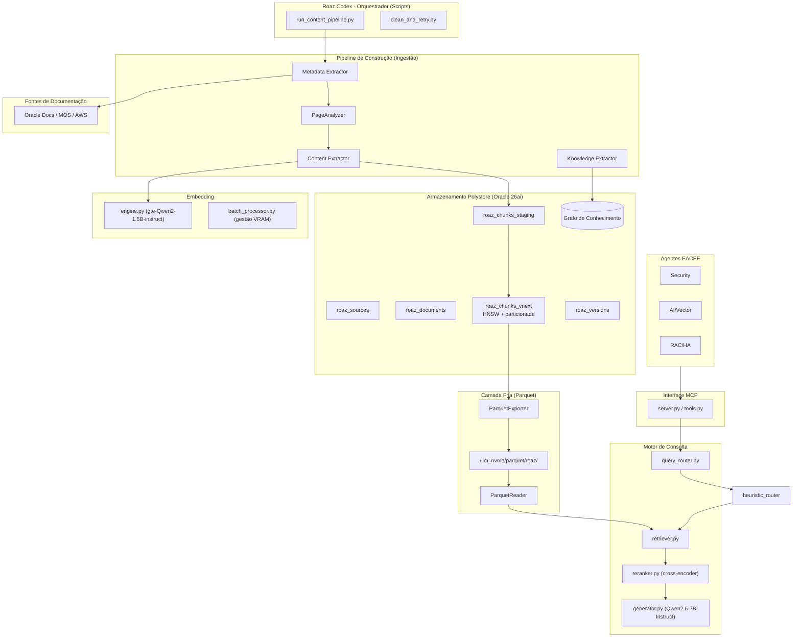
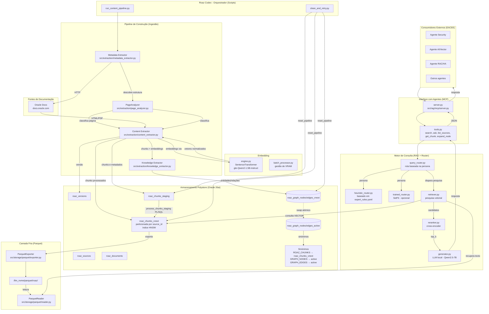

# Roaz Codex – Orquestrador de Inteligência para Ambientes de Dados Críticos


[](https://www.python.org/)
[](https://www.oracle.com/database/)
[](LICENSE)

**Roaz Codex** é o cérebro de conhecimento do ecossistema **EACEE**. Ele transforma documentação técnica (Oracle, AWS, etc.) num modelo de conhecimento estruturado, disponibilizado via **MCP (Model Context Protocol)** para agentes autónomos, assistentes de IA e equipas de arquitetura.

---

## 📌 Índice

- [Visão Estratégica](#visão-estratégica)
- [Arquitetura de Alto Nível](#arquitetura-de-alto-nível)
- [Fluxo de Processamento de Dados](#fluxo-de-processamento-de-dados)
- [Base de Conhecimento – 14 Pilares da Sabedoria](#base-de-conhecimento--14-pilares-da-sabedoria)
- [Componentes Técnicos](#componentes-técnicos)
- [Requisitos de Ambiente](#requisitos-de-ambiente)
- [Instalação e Configuração](#instalação-e-configuração)
- [Execução dos Pipelines](#execução-dos-pipelines)
- [Consulta via MCP (Agentes)](#consulta-via-mcp-agentes)
- [Estrutura de Diretórios](#estrutura-de-diretórios)
- [Próximos Passos – Oracle 26ai Native](#próximos-passos--oracle-26ai-native)

---

## 🧠 Visão Estratégica

O **Roaz Codex** não é apenas um motor de busca documental. É uma camada de **Governança e Segurança Cognitiva** que:

- Converte a complexidade da infraestrutura de dados em **agilidade arquitetural**.
- Alinha decisões técnicas (ex.: Oracle 26ai) com **diretrizes de Arquitetura Empresarial** (EA).
- Fornece um **protocolo de execução triplo** – validando sintaxe, segurança/STIG e impacto arquitetural (FinOps).
- Gera **planos de acção auditáveis** com pré‑requisitos, scripts comentados, rollback e justificação de valor.

Cada acção proposta pelo Roaz é filtrada por um **Escudo (The Shield)** antes de ser entregue ao utilizador ou agente.

---

## 🏛️ Arquitetura de Alto Nível



---

## 🏛️ Arquitetura de Baixo Nível



---

## ⚙️ Fluxo de Processamento de Dados

### 1. Metadata Extractor (`metadata_extractor.py`)
- Acede ao `toc.htm` do guia Oracle e descobre toda a estrutura hierárquica (páginas, níveis, ordem).
- Extrai metadados da raiz (produto, feature, versão, idioma).
- Insere/actualiza `roaz_sources` e constrói o **grafo de navegação** (`graph_nodes/edges_vnext`).

### 2. PageAnalyzer (`page_analyzer.py`)
- Classifica cada página num dos tipos: `conceptual`, `procedural`, `reference`, `scenario`, `troubleshooting`, `glossary`, `index`.
- Recomenda **estratégia de chunking** (estrutural vs semântico), tamanho ideal do chunk, overlap e uso de breadcrumbs.
- Extrai metadados complementares (presença de comandos, tabelas, definições, etc.).

### 3. Content Extractor (`content_extractor.py`)
- Descarrega cada página (com fallback para Selenium se o conteúdo estático for insuficiente).
- Aplica o `PageAnalyzer` para obter a classificação.
- Gera **chunks** usando a estratégia recomendada (`structural_chunker` ou `semantic_chunker`).
- Gera **embeddings** (modelo `gte-Qwen2-1.5B-instruct`, 1536 dims, normalizado L2) via GPU com gestão de memória.
- Insere os registos em `roaz_chunks_staging` (colunas separadas).
- Chama a **procedure PL/SQL `process_chunks_staging`** que converte o CLOB para `VECTOR` e move para `roaz_chunks_vnext`.
- Exporta os chunks para **Parquet** (um ficheiro por documento) na camada fria.
- Regista a versão em `roaz_versions`.

### 4. Knowledge Extractor (`knowledge_extractor.py`)
- Extrai **entidades** (comandos, conceitos, parâmetros, siglas) e **relações** (IS_A, PART_OF, REFERENCES) usando heurísticas ou LLM.
- Popula o **grafo de conhecimento** (`roaz_graph_nodes/edges_vnext`).
- O grafo é trocado atomicamente para `_active` via script `swap_graph.sql`, mantendo os sinónimos `GRAPH_NODES` e `GRAPH_EDGES` sempre apontando para a versão activa.

### 5. Motor de Consulta (RAG + Router)
- **`heuristic_router.py`** – classifica a pergunta por domínios (`security`, `rac_ha`, `ai_vector`) usando palavras‑chave do `expert_rules.yaml`.
- **`trained_router.py`** (futuro) – utilizará um modelo SetFit para classificação mais precisa.
- **`query_router.py`** – decide a estratégia de recuperação com base na persona detectada.
- **`retriever.py`** – pesquisa vetorial no Oracle usando o índice HNSW (`vector distance`), filtra por `source_id`, devolve os chunks mais similares.
- **`reranker.py`** – aplica um cross‑encoder (`BAAI/bge-reranker-large`) para reordenar os candidatos com maior precisão semântica.
- **`generator.py`** – gera a resposta final com um LLM local (`Qwen2.5-7B-Instruct` em 4‑bits) ou, em modo extractivo, devolve o chunk mais relevante.

### 6. Servidor MCP (`server.py` + `tools.py`)
- Expõe as ferramentas `search`, `ask`, `list_sources`, `get_chunk`, `expand_node` (navegação no grafo) e recursos (`roaz://sources`, `roaz://version`, `roaz://status`).
- Comunica via **stdio** com qualquer cliente MCP (Claude Desktop, Ollama, agentes EACEE).

---

## 🧱 Base de Conhecimento – 14 Pilares da Sabedoria

A matriz de conhecimento do Roaz está organizada em 14 domínios interligados, que servem de base para treino, RAG e governança.

| # | Pilar | Domínios Integrados | Fontes de Dados |
|---|-------|---------------------|------------------|
| 01 | **Runtime & Observability** | Monitorização, logging, SLA, previsão de demanda | OCI Monitoring/Logging APIs, V$Views, AWR |
| 02 | **Design & Engineering** | Modelagem de dados, API, Workspaces, Delta Sharing | Guias Oracle 26ai, especificações do AI Data Platform |
| 03 | **Risk & Resilience** | Planos de resposta a incidentes, continuidade de negócio | My Oracle Support, post‑mortems, OCI incidentes |
| 04 | **Platform & Vendor** | Selecção de cloud, licenciamento, multi‑cloud | Cloud Adoption Frameworks, contratos, feature matrix |
| 05 | **Security & IAM** | Estratégia IAM, isolamento de rede, RBAC, auditoria | CIS Benchmarks, STIGs, logs IAM, políticas OCI |
| 06 | **Strategic Alignment** | Objectivos de negócio, gestão de mudança, OKRs | Documentos estratégicos, roadmaps, BIA |
| 07 | **AI & Data Processing** | Busca vectorial, integração com LLMs, inferência em lote | Oracle 26ai Vector Guide, OCI Generative AI |
| 08 | **Capacity & Baseline** | Estimativa de recursos, inventário de assets, quotas | Relatórios de capacidade, OCI Resource Quotas |
| 09 | **FinOps & Efficiency** | ROI, optimização de custos, orçamentação | OCI Billing API, relatórios de custos, Jira |
| 10 | **Quality & Governance** | Qualidade de dados, catálogo mestre, auto‑população de metadados | Metadados do catálogo, regras de qualidade, FRD |
| 11 | **Integration & Migration** | Planeamento de migração, sincronização cross‑catalog, CI/CD | Runbooks de migração, OCI Data Integration, scripts |
| 12 | **Legal & Lifecycle** | Retenção de dados, conformidade (LGPD/GDPR), sensibilidade | Manuais legais, DPIA, acordos de partilha |
| 13 | **Innovation & Future-Proofing** | Tecnologias emergentes (Quantum, Edge AI) | Whitepapers, patentes, journals, relatórios de P&D |
| 14 | **Data Culture & Literacy** | Definição de papéis, colaboração, literacia de dados | Logs de treino, matriz de competências, métricas de adopção |

Estes pilares estão representados no **grafo de conhecimento** e podem ser consultados via MCP (`expand_node` para navegar entre conceitos).

---

## 🔧 Componentes Técnicos

| Módulo | Localização | Função |
|--------|-------------|--------|
| **Core** | `src/core/` | Configuração, conexão Oracle, tipos comuns, logging |
| **Extraction** | `src/extraction/` | Metadata, PageAnalyzer, Content, Knowledge extractors; parsers, scorers, scheduler, chunkers |
| **Storage** | `src/storage/` | Repositórios (sources, documents, chunks, versions, graph); exportação/leitura Parquet; gestão de objectos Oracle (diretórios, tabelas externas) |
| **Embedding** | `src/embedding/` | Motor de embeddings (`engine.py`), registo de modelos, processamento em lote com controlo de VRAM |
| **RAG** | `src/rag/` | Retriever, reranker, generator, query router, servidor MCP e ferramentas |
| **Router** | `src/router/` | Heurístico (`expert_rules.yaml`) e treinado (SetFit) |
| **Scripts** | `scripts/` | `run_content_pipeline.py`, `clean_and_retry.py`, `validate/check_phase_0.sh` |
| **SQL** | `sql/migrations/` | `swap_graph.sql` para troca atómica do grafo |

---

## 💻 Requisitos de Ambiente

- **Sistema Operativo**: Oracle Linux 8 / 9 (recomendado) ou Ubuntu 22.04+
- **Hardware mínimo**:
  - CPU: 16 cores
  - RAM: 128 GB 
  - GPU: NVIDIA RTX 3060 (12 GB VRAM) ou superior (para embeddings e LLM)
  - Armazenamento: `/llm_nvme` com 2TB (Parquet, modelos, dados)
- **Software**:
  - Python 3.12
  - Oracle Database 26ai (ou 23.26) com schema `ROAZ` criado (fornecido em `roaz_ddl.sql`)
  - Chrome/Chromium para `undetected-chromedriver` (fallback dinâmico)
- **Variáveis de ambiente** (ficheiro `.env`):
  ```ini
  ROAZ_DB_USER=roaz
  ROAZ_DB_PASSWORD=your_password
  ROAZ_DB_DSN=localhost/appspdb
  ROAZ_HOME=/llm_nvme/roaz
  ROAZ_DATA=/llm_nvme/data
  ROAZ_PARQUET_DIR=/llm_nvme/parquet/roaz
  ```

---

## 🚀 Instalação e Configuração

```bash
# 1. Clonar o repositório (já em /llm_nvme/roaz)
cd /llm_nvme/roaz

# 2. Criar ambiente virtual e activar
python3.12 -m venv .venv
source .venv/bin/activate

# 3. Instalar dependências (requirements.txt)
pip install --upgrade pip
pip install -r requirements.txt

# 4. Configurar ficheiro .env com as credenciais do Oracle

# 5. Validar ambiente
sudo ./scripts/validate/check_phase_0.sh

# 6. Inicializar o schema Oracle (executar como SYSTEM)
sqlplus system@localhost/appspdb < roaz_ddl.sql
```

---

## 🏭 Execução dos Pipelines

### Ingestão de um novo guia (fonte)

1. Inserir uma fonte manualmente (ou via script):
   ```sql
   INSERT INTO roaz_sources (source_url, title) 
   VALUES ('https://docs.oracle.com/en/database/oracle/oracle-database/23/dgbkr/', 'Data Guard Broker Guide');
   ```

2. Executar o pipeline de conteúdo:
   ```bash
   python scripts/run_content_pipeline.py <source_id>
   ```

   O script:
   - Descarrega todas as páginas.
   - Aplica o `PageAnalyzer` e chunking.
   - Gera embeddings e popula a staging.
   - Move para `roaz_chunks_vnext` via procedure.
   - Exporta Parquets e regista nova versão.

### Processamento do conhecimento (entidades/relações)

```bash
python -m src.extraction.knowledge_extractor
```

### Limpeza de falhas

```bash
python scripts/clean_and_retry.py <source_id> --hard
```

---

## 🔍 Consulta via MCP (Agentes)

### Iniciar o servidor MCP

```bash
python -m src.rag.mcp.server
```

### Configuração no Claude Desktop (`claude_desktop_config.json`)

```json
{
  "mcpServers": {
    "roaz": {
      "command": "python",
      "args": ["-m", "src.rag.mcp.server"],
      "env": {
        "PYTHONPATH": "/llm_nvme/roaz"
      }
    }
  }
}
```

### Ferramentas disponíveis

| Ferramenta | Descrição | Exemplo de parâmetros |
|------------|-----------|----------------------|
| `search`   | Pesquisa vetorial no conhecimento Oracle | `{"query": "broker configuration", "top_k": 5}` |
| `ask`      | Pergunta + resposta gerada (RAG completo) | `{"question": "What is Data Guard broker?"}` |
| `list_sources` | Lista todas as fontes catalogadas | `{}` |
| `get_chunk` | Recupera o texto completo de um chunk | `{"chunk_id": 1234}` |
| `expand_node` | Navega no grafo a partir de um nó | `{"node_id": 567, "relation_type": "IS_A"}` |

---

## 📁 Estrutura de Diretórios (após limpeza)

```
/llm_nvme/roaz/
├── src/
│   ├── core/                 # configuração, conexão, logging, tipos
│   ├── embedding/            # engine, batch_processor, model_registry
│   ├── extraction/           # metadata_extractor, content_extractor, knowledge_extractor, page_analyzer
│   │   ├── chunker/          # structural_chunker, semantic_chunker
│   │   ├── discovery/        # toc_discovery, graph_traversal
│   │   ├── parser/           # html_parser, pdf_parser, content_cleaner
│   │   ├── scheduler/        # job_dispatcher, priority_queue
│   │   └── scorers/          # length_scorer, technical_density, composite
│   ├── rag/                  # retriever, reranker, generator, query_router
│   │   └── mcp/              # server, tools
│   ├── router/               # heuristic_router, trained_router
│   ├── storage/              # repository, parquet, oracle_objects
│   └── utils/                # (reservado)
├── scripts/
│   ├── validate/             # check_phase_0.sh
│   ├── run_content_pipeline.py
│   └── clean_and_retry.py
├── sql/
│   └── migrations/           # swap_graph.sql
├── configs/
│   ├── pipelines.yaml
│   ├── expert_rules.yaml
│   └── sources.yaml
├── models/                   # router/ (SetFit)
├── data/                     # staging/
├── tests/                    # __init__.py
├── .env
├── requirements.txt
└── README.md
```

---

## 🧭 Próximos Passos – Oracle 26ai Native

Com base nas features nativas do Oracle 26ai, o Roaz evoluirá para uma arquitetura **Oracle‑only**, eliminando dependências externas e maximizando desempenho, segurança e simplicidade.

### 1️⃣ Hybrid Vector Search (substitui Weaviate)
- **Objectivo:** Substituir a necessidade de um motor externo de busca híbrida (Weaviate) usando `Hybrid Vector Index` do Oracle.
- **Actividades:**
  - [ ] Criar um índice híbrido (BM25 + cosine) sobre `roaz_chunks_vnext`.
  - [ ] Modificar `retriever.py` para usar a cláusula `HYBRID` ou combinar `VECTOR_DISTANCE` com `CONTAINS`.
  - [ ] Validar a qualidade dos resultados comparada com a abordagem anterior (Weaviate + ColBERT).

### 2️⃣ Reranker In‑Database (substitui `reranker.py`)
- **Objectivo:** Executar o cross‑encoder (`BAAI/bge-reranker-large`) dentro do Oracle como modelo ONNX.
- **Actividades:**
  - [ ] Converter o modelo para ONNX (script `export_reranker_to_onnx.py`).
  - [ ] Importar o modelo via `DBMS_VECTOR.LOAD_ONNX_MODEL`.
  - [ ] Criar uma função PL/SQL que recebe query e lista de candidatos e retorna scores reordenados.
  - [ ] Chamar a função directamente na consulta SQL, eliminando a etapa Python.

### 3️⃣ Chunking com `VECTOR_CHUNKS` (fallback para páginas sem estrutura)
- **Objectivo:** Utilizar a API nativa `VECTOR_CHUNKS` para dividir texto corrido (ex.: PDFs extraídos) em chunks.
- **Actividades:**
  - [ ] No `content_extractor.py`, quando o chunking estrutural falhar ou para documentos sem HTML, invocar `VECTOR_CHUNKS` via SQL.
  - [ ] Manter o `PageAnalyzer` em Python para classificação, mas delegar o split ao banco quando apropriado.

### 4️⃣ Classificação de Páginas com ML In‑Database
- **Objectivo:** Substituir o `PageAnalyzer` heurístico por um modelo treinado (Random Forest / XGBoost) dentro do Oracle.
- **Actividades:**
  - [ ] Coletar um dataset histórico de classificações (página → tipo).
  - [ ] Treinar um modelo usando Oracle Machine Learning (OML) com as features extraídas (contagem de comandos, tabelas, etc.).
  - [ ] Implantar o modelo como `MINING MODEL` e usá‑lo em consultas SQL para classificar novas páginas.
  - [ ] Remover gradualmente as regras heurísticas do `page_analyzer.py`.

### 5️⃣ Uso de `Select AI` com RAG (Modo Opcional)
- **Objectivo:** Oferecer uma ferramenta MCP adicional que utiliza o `Select AI` do Oracle para responder perguntas em linguagem natural, com RAG integrado.
- **Actividades:**
  - [ ] Configurar credenciais para um provedor de LLM (Cohere, Anthropic, etc.) via `DBMS_CLOUD_AI`.
  - [ ] Criar a ferramenta MCP `select_ai(query, source_ids)` que executa `SELECT AI` sobre a visão dos chunks.
  - [ ] Documentar que esta ferramenta envia dados para a cloud (não adequada para dados sensíveis).

### 6️⃣ Classificador de Domínios Treinado (Router)
- **Objectivo:** Melhorar o `trained_router.py` usando dados sintéticos gerados a partir dos próprios chunks.
- **Actividades:**
  - [ ] Gerar perguntas sintéticas para cada um dos 14 pilares usando o próprio LLM local.
  - [ ] Treinar um modelo SetFit (ou equivalente) e guardar em `models/router/`.
  - [ ] Integrar ao `query_router.py` como estratégia primária, com fallback heurístico.

### 7️⃣ Multi‑Agente MCP (Orquestração Inteligente)
- **Objectivo:** Permitir que o servidor MCP execute tarefas complexas (ex.: pesquisar → expandir nó do grafo → gerar relatório) numa única chamada.
- **Actividades:**
  - [ ] Implementar `src/rag/mcp/agent.py` com um planner baseado no LLM local.
  - [ ] Adicionar a ferramenta `run_agent(task, source_ids)` que aceita descrições de tarefas multi‑passo.
  - [ ] Limitar o número de passos e adicionar controlo de segurança.

### 8️⃣ Suporte a PDFs e Outros Fornecedores (AWS/Azure)
- **Objectivo:** Expandir as fontes de documentação.
- **Actividades:**
  - [ ] Melhorar `pdf_parser.py` usando `pdfplumber` e integrar ao pipeline.
  - [ ] Criar módulos de descoberta para AWS (AWS User Guide) e Azure (Docs).
  - [ ] Unificar os metadados (`source_type`, `product`, `feature`) no repositório.

### 9️⃣ Dashboard de Monitorização
- **Objectivo:** Visualizar saúde do sistema, versões, falhas e performance dos chunks.
- **Actividades:**
  - [ ] Criar uma interface CLI (Textual) ou web (FastAPI + React) que consulte as tabelas de controlo (`roaz_pipeline_control`, `roaz_versions`, etc.).
  - [ ] Expor métricas como tempo médio de pesquisa, uso da Vector Memory Pool, distribuição de tipos de página.

---

## 📜 Licença

Proprietário – EACEE. Todos os direitos reservados. O uso interno é permitido sob os termos da licença de software da empresa.

---

## 🤝 Contribuição

Este projecto é desenvolvido internamente pela equipa de Arquitetura de Dados e AI. Para sugestões ou relatórios de incidentes, contacte **Exated Softwares Ltda**.

---


**Nota:** O README agora foca em **Oracle 26ai nativo** para os próximos passos, removendo a dependência de Weaviate e reranker externo, e detalhando como cada feature será aproveitada. Os diagramas e a estrutura permanecem consistentes com o código actual. Basta substituir o conteúdo do ficheiro README.md pelo conteúdo acima.
